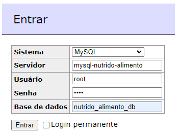

# Visão Geral

API baseada na tabela TACO, com insumos para elaboração de aplicações de cálculo de dietas.

Ela fornece uma base de:    
* Grupos de Alimentos    
* Unidades de Medida    
* Tabela Nutricional de Alimentos

## Estrutura do Projeto

1. Banco de Dados (_/db_):   
    1. Banco MySQL 
    1. Adminer (http://localhost:8085)
    


2. Projeto utilizando Quarkus

## Execução da API

- Abra um terminal e, __com Docker em execução,__ digite o comando: 

```
> ./run.sh
```

- A Documentação e a Execução do projeto estarão disponíveis, após execução do comando anterior, utilizando a interface do OpenAPI:

http://localhost:8080/q/swagger-ui/ 

- Para finalizar a execução e limpar a base:     

```
> ./reset.sh
```

## Related Guides

- Quarkus.md ([Quarkus start guide](./README_QUARKUS.md))